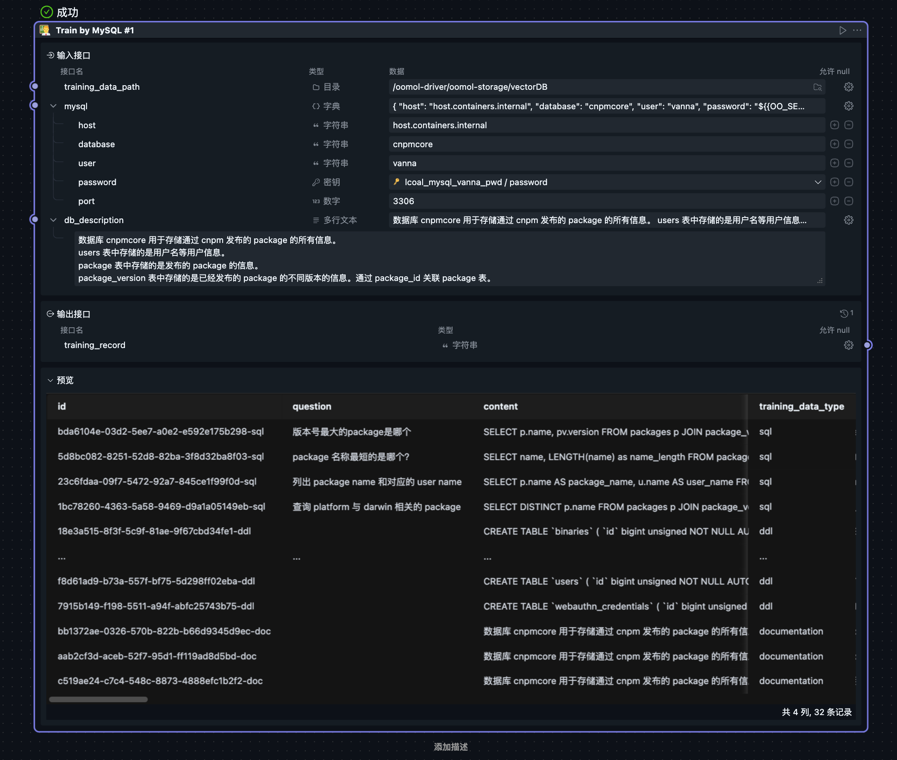
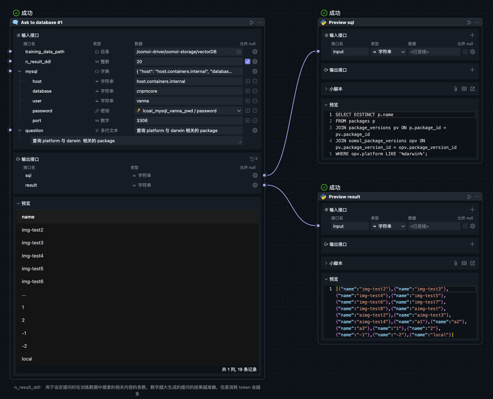

# Ask To Database
This project is developed based on [Vanna](https://github.com/vanna-ai/vanna).  
The main functionality is to interact with databases using natural language, outputting automatically generated SQL statements and query results.

The project requires reading database table contents.

## Usage
This project requires the following two steps:
1. Training  
  
Use the Train Flow to train the model. Users need to specify a directory for storing training data and provide database connection details, along with a detailed description of the database.  
Training data provides context for subsequent queries, enabling more accurate SQL generation.  
If the database tables themselves have comments, it is even better.  

Training only needs to be done once, as the generated data can be reused. Therefore, training and querying are separated. To delete all training data, simply clear the training data directory.  

2. Querying  
  
Use the Ask Flow to query. Users need to provide database connection details, the training data directory, and a natural language question. The system will return the generated SQL statement and query results.  
Without training data, queries may fail due to insufficient context.  

If the generated SQL is incorrect, try:  
1. Adding more training data and retraining.  
2. Increasing the `n_result_ddl` parameter to reference more training data during SQL generation, though this may increase token consumption.  

## Project Structure  
### Flow  
#### Train  
Reads the database schema and user-provided table descriptions based on the MySQL connection input, storing them in a vector database.  
More detailed table descriptions improve the accuracy of natural language queries. If the database tables have comments, it enhances the results.  
Training can be repeated, updating existing data without duplication if the content remains unchanged.  

To delete all training data, simply clear the training data directory.  

#### Ask  
Generates SQL statements using a large model based on training results, executes them, and returns the query results and SQL for preview.  
Insufficient or unclear training information may lead to incorrect SQL or errors.  

Users can specify the number of training data entries referenced during SQL generation (default is 10). More entries improve accuracy but increase token consumption.  

Successful queries store the results and SQL as training data in the vector database for future use.  

#### Delete Training Data  
Users can delete training data by ID.  

### Shared Block  
#### train_by_mysql  